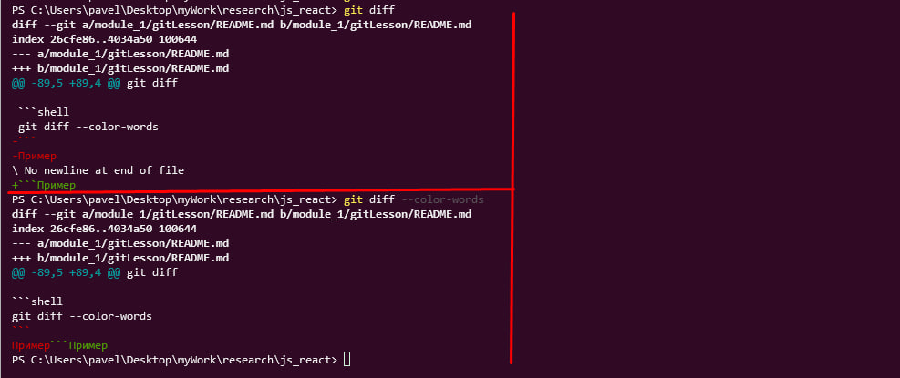

# Git и Github система контроля версии

## git config

Для того чтобы посмотреть настройки git нужно ввести команду `git config --list`

Для того чтобы прописать глобальные настройки нужны следующие команды

- в двойных кавычках вместо точек нужно прописать свое имя или ник.

```shell
git config --global user.name "..."
```

- этой командой записывается емайл который использовался для регистрации на github

```shell
git config --global user.email "..."
```

- Как известно, в разных операционных системах приняты разные символы для перевода строк, в Windows - это два символа \r\n (или CR и LF, код 0D0A в 16-ричной системе счисления), в \*nix - просто \n (LF, код 0A), а в Mac - \r (CR, код 0D). Настройка core.autocrlf предназначена для того, чтобы в главном репозитории все переводы строк текстовых файлах были одинаковы.

Работает эта настройка так. Пусть для репозитория настройка core.autocrlf установлена в значение true следующей командой

```shell
git config --global core.autocrlf true
```

Тогда при коммитах (или, если более строго, при чтении файлов из файловой системы) все переводы строк при хранении будут приведены к виду \n, как в \*nix, а при записи в файлы будут преобразованы к виду \r\n, как в Windows.

**Но по крайней мере в Windows проблемы с этой настройкой есть, кроме того возможны ситуации, когда Git примет бинарные файлы за текстовые и примется в них исправлять переводы строк. В этом случае мы получим порчу файлов. Если честно, немного странно видеть эту возможность в Git, когда Линус Торвальдс на одном из докладов сказал такую фразу, что когда он начал делать Git, то хотел бы, чтобы в ней файлы не портились и извлекались из репозитория в том виде, в каком они туда попали. Хотя эта возможность отключается.**

- Установка отображения unicode

```shell
git config --global core.quotepath off
```

- Вывод предупреждение о смене символа для перевода строк
  
```shell
git config --global core.safecrlf warn
```

- Установка ветки по умолчанию 

```shell
git config --global core.defaultBranch main
```

---

# Создание репозитория

- Для создания репозитория, нужно из папки проекта, набрать команду:
```shell
git init
```


- Для добавления одного файла в репозиторий:

```shell
git add index.html
```


- или добавление всех файлов

```shell
git add .
```
или 
```shell
git add -A
```


- Для удаления файл только из репозитория и локально требуется команда 

```shell
git mr путь_до_файл_относительно_коневой_директории
```
Если требуется удалить только с удалённого репозитория нужно добавить флаг `--cached`  

```shell
git mr --cached путь_до_файл/папки_относительно_коневой_директории
```
Если требуется удалить папку то нужно добавить флаг `-r`, что означение рекурсивно
```shell
git mr -r --cached путь_до_файл/папки_относительно_коневой_директории
```


- Выполнить коммит (сделать слепок) текущего состояния проекта

```shell
git commit -m "сообщение"
```

- Для просмотра изменения до предыдущего коммита

```shell
git diff
```

- Для того чтобы подсветить изменения, а именно для добавление в зелёный цвет, для удаления в красный цвет к команде `git diff` добавляется флаг `--color-words`

```shell
git diff --color-words
```
Пример в powerShell эти команды работают одинокого



- Для того чтобы восстановить удаленный фаил нужна команда

```shell
git checkout имя_файла
```

- Если нужно восстановить все файлы или откатиться к предыдущему коммиту
```shell
git checkout .
```

---

# Для подключения репозитория к github

- После его создания нужно выполнить последовательно команды если он еще не создан локально

```shell
git init
git add README.md
git commit -m "first commit"
git branch -M main
git remote add origin путь до репозитория
git push -u origin main
```
- или если репозиторий уже инициализирован локально и в нем уже ведутся работы то достаточно  выполнить следующие команды

```shell
git branch -M main
git remote add origin путь до репозитория
git push -u origin main
```

- `git branch -M main` Если в конфиге прописана дефолтная ветка то эту команду можно пропустить
  
##### Отправить данные в репозиторий
```shell
git push -u origin main
```

---